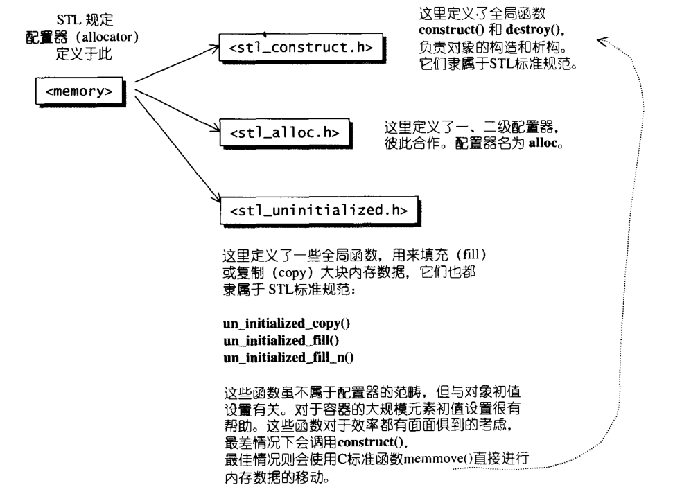
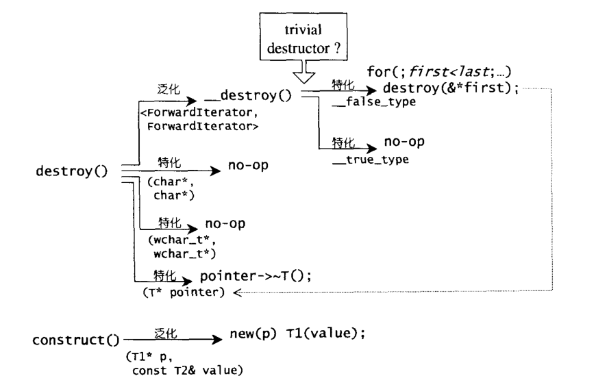
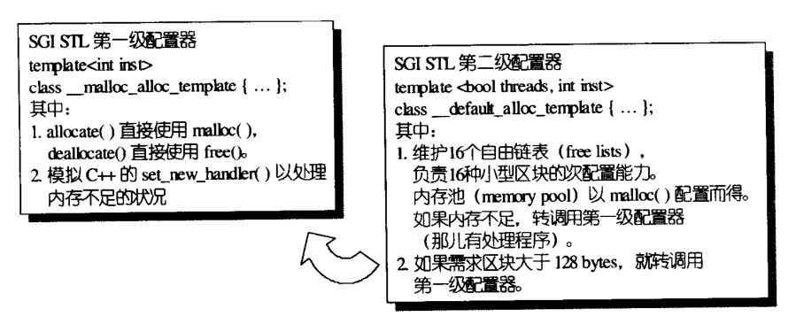
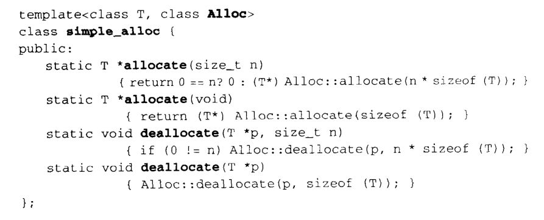

# 空间配置器

在STL中，allocator隐藏在一切container的背后，整个STL的操作对象都存放在容器之内，而容器一定需要配置空间以放置资料。所以在理解整个STL设计实现的过程中，第一步先需要了解配置器。


# 具备次配能力(sub-allocation)的SGI空间配置器

SGI STL配置器的名称是alloc而非allocator，而且不接受任何参数。

不可以采用标准写法：

```c++
vector<int, std::allocator<int>> iv;
```

而必须这样写：

```c++
vector<int, std::alloc> iv;
```

SGI STL中的每个container都指定了缺省的空间配置器alloc，如vector中声明：

```c++
template <class T, class Alloc = alloc> // 缺省使用alloc为分配器
class vector { ... };
```


## SGI标准的空间配置器，std::allocator

SGI STL中也有符合标准，名称为allocator的配置器，但是其仅仅是对`::operator new`和`::operator::delete`做了一层封装，效率不佳。所以SGI中从未使用过它，也不建议使用。

## SGI特殊的空间配置器，std::alloc

一般来说，我们习惯的C++内存申请/释放操作通常是这样：

```c++
class Foo { ... };
Foo* pf = new Foo;	// 分配内存，然后构造对象
delete pf;			// 析构对象，然后释放内存
```

其中的new包括了两个阶段：

1. 调用::operator new分配内存
2. 调用Foo::Foo()构造对象

同理，delete也包括两个阶段：

1. 调用Foo::~Foo()析构对象
2. 调用::operator delete释放内存

在STL中，内存分配由alloc::allocate()负责，内存释放由alloc::deallocate()负责；对象构造由::construct()负责，对象析构由::destroy()负责。

具体的分布见下图：




## 构造与析构

在上一小节中可以看到，对象的构造与析构由stl_construct.h负责，其中定义了全局函数construct()与destroy()。



construct()接收一个指针p和一个初值value。然后通过`new(p) T1(value);`的方式来完成初始化。

`new(p) T1(value)`这一操作叫做`placement new`，在指针p所指向的内存空间创建一个T1类型的对象，但是对象的内容是从T2类型的对象转换过来的（调用了T1的构造函数，T1::T1(value)）。这一操作类似C中的realloc，在已有空间的基础上重新调整分配的空间。

destroy()有两个版本，第一个版本接收一个指针，通过调用该对象的析构函数即可。另一个版本接收first和last两个指针，将对[first, last)内的对象进行判断并选择是否析构。判断是依据value_type()获取迭代器所指对象类型，再通过__type_traits\<T>来判断该类别的析构函数是否无关痛痒(trivial destructor)。如果为\_\_false_type，则对范围内的对象调用第一个版本的destroy()；如果是\_\_true_type，则不进行任何操作。

## 空间的分配与释放

这部分由stl_alloc.h负责：

1. 向system heap申请空间；
2. 考虑多线程状态；
3. 考虑内存不足时的情况；
4. 考虑内存碎片。



SGI STL设计了双层配置器，第一级配置器（__malloc_alloc_template）直接调用malloc和free来完成空间的分配。第二级配置器（\_\_default_alloc_template）当分配的区块大于128bytes时调用第一级配置器，否则使用内存池。为了符合STL规范，SGI还为这两级配置器包装了一层接口simple\_alloc。




